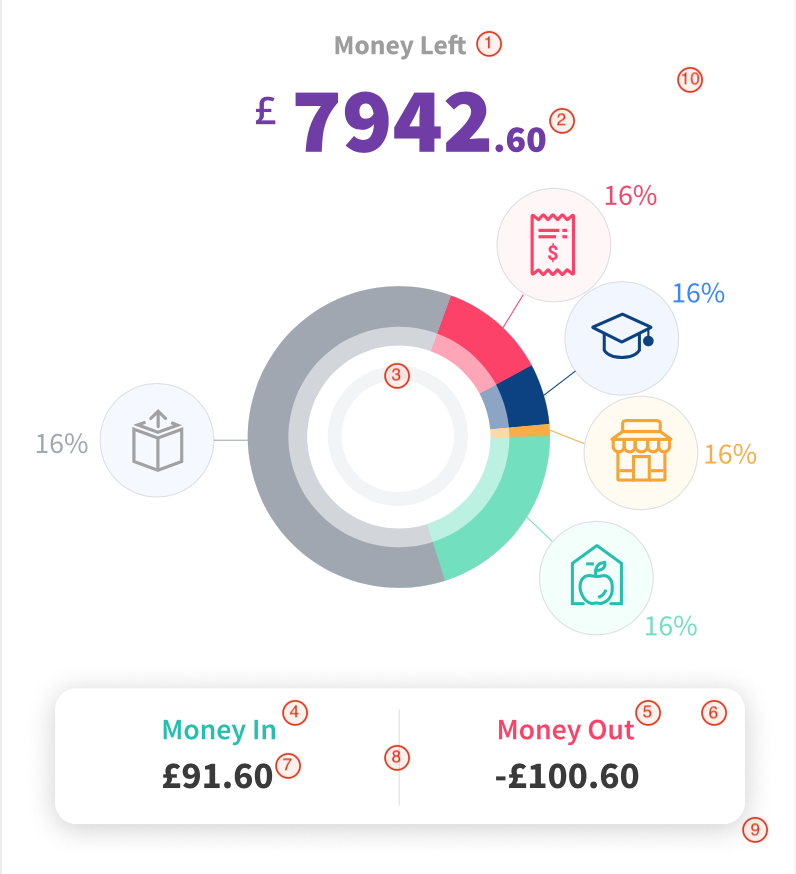

# FriendlyScore Finance Manager Custom UI Theme
`FriendlyScoreFinanceManager` can be presented with predefined UI theme (`light` and `dark`) but there is also possibility to create custom sets of colors.  Based on [template file](https://friendlyscore.com), edit key-value list of colors to match your brand's guildlines. Then, save edited file in your project's document path and load it as follows:
```swift
FriendlyScore.showInsights(with: myCredentials, theme:.custom("path/to/your/theme.json"))
```
or

```swift
FriendlyScore.showForecast(with: myCredentials, theme:.custom("path/to/your/theme.json"))
```

Here is a complete list of color keys and coresponding areas on views

<p align="left">


1. `pfmToolbarTitleTextColor`
2. `pfmToolbarDividerColor`
3. `pfmSelectorButtonIconColor`
4. `pfmSelectorButtonText`
5. `pfmSelectorButtonBackgroundColor`
6. `pfmSelectorButtonBackgroundShadowColor`
7. `pfmSelectedTabTextColor`
8. `pfmTabTextColor`
9. `pfmCurrencyTabIndicatorColor`
10. `pfmCurrencyTabDividerColor`
11. `pfmHeaderBackgroundColor`





1.  `pfmRecentBalanceLabelColor`
2.  `pfmRecentBalanceValueColor`
3.  `pfmInnerCircleColor`
4.  `pfmMoneyInColor`
5.  `pfmMoneyOutColor`
6.  `pfmMoneyInMoneyOutBoxBackgroundColor`
7.  `pfmMoneyInOutValueColor`
8.  `pfmMoneyInMoneyOutDividerColor`
9.  `pfmMoneyInMoneyOutBoxBackgroundShadowColor`
10. `pfmBackgroundColor`


1.  `pfmDropDownTransactionItemColor`
2.  `pfmCategoryListItemLabelTextColor`
3.  `pfmCategoryListItemAmountColor`
4.  `pfmCategoryListItemPercentageColor`
5.  `pfmCategoryListItemDividerColor`


1.  `pfmChartTitleTextColor`
2.  `pfmAxisLabelColor`
3.  `pfmGridLineColor`
4.  `pfmHistoricalChartLineColor`
5.  `pfmFutureChartLineColor`
6.  `pfmLineChartPositiveFillColor`
7.  `pfmLineChartNegativeFillColor` (android only)
8.  `pfmAxisLineColor`


1.  `pfmIncomeColor`
2.  `pfmBalanceColor`
3.  `pfmExpensesColor`


1.  `pfmPoweredByBackground`
2.  `pfmPoweredByLabel`

